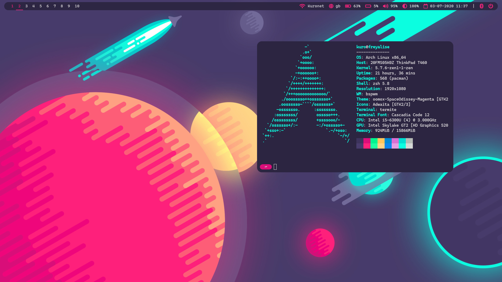
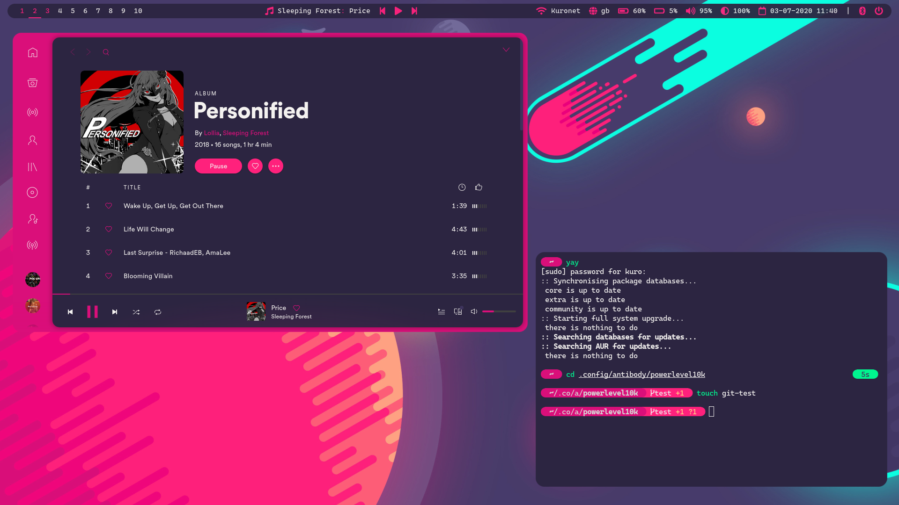
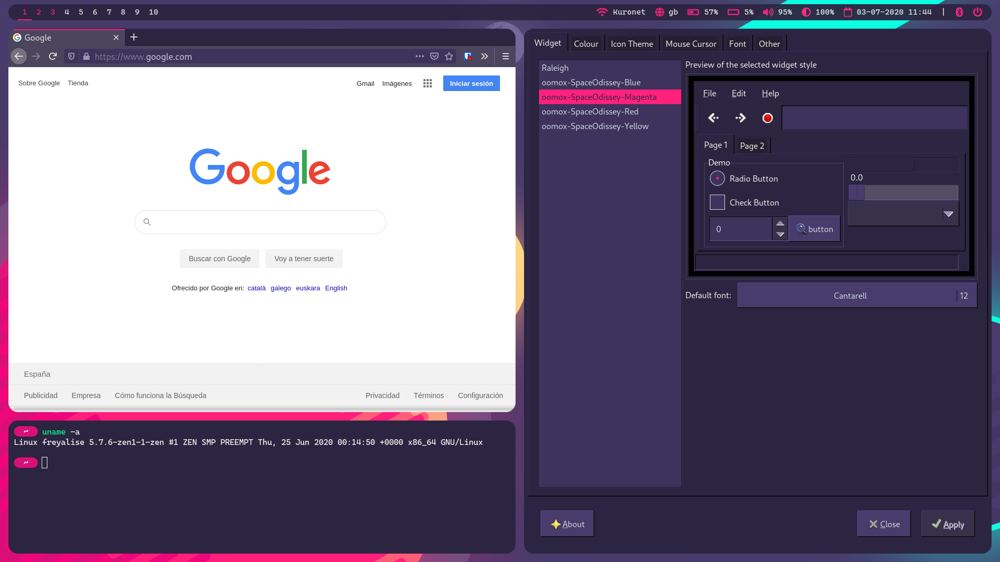

# Kurolox's dotfiles

## Gallery

## Description
Here is a collection of my personal dotfiles, which include:

- BSPWM and SXHKD configuration and keybindings
- Polybar configuration and scripts
- A custom .Xresources color palette
- Four GTK theme variants based on the theme color scheme (made with oomox)
- rofi custom menus and configurations
- termite color scheme and configuration
- zsh configuration and custom color scheme based on powerlevel10k
- dunst notifications
- picom configuration
- Custom themes for different applications (Spotify, Discord, Telegram Desktop...)